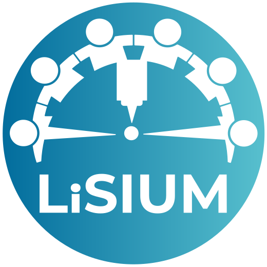
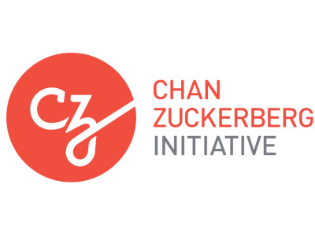
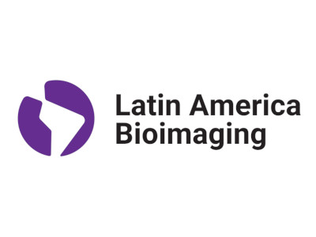
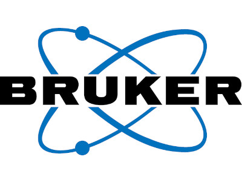
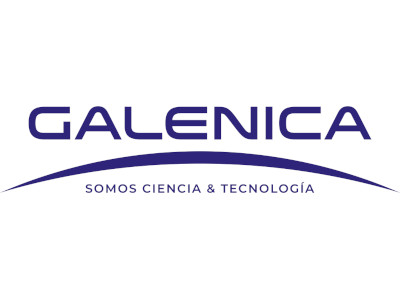

# Home

::: {.columns}

::: {.column width="15%"}

{width="100"}

:::

::: {.column width="85%"}

Welcome! This website contains the materials for the [Light-Sheet Image Analysis Workshop](https://lightsheetchile.cl/light-sheet-image-analysis-workshop-2026-2/) organized by the [Light-Sheet Imaging at Universidad Mayor](https://lightsheetchile.cl/) (LiSIUM). The course will be held at the [Center for Integrative Biology](https://cib.umayor.cl/en/) of [Universidad Mayor](https://www.umayor.cl/santiago) during 5–9 of January, 2026 in Santiago, Chile.

:::

:::

::: {style="text-align: center; padding-top: 1rem;"}

[Program](program.md){.btn .btn-primary .rounded}
[Resources](resources.md){.btn .btn-primary .rounded}
[Course Website](https://lightsheetchile.cl/light-sheet-image-analysis-workshop-2026-2/){.btn .btn-primary .rounded}
[Course Information](https://lightsheetchile.cl/resources-image-analysis-workshop-2026/){.btn .btn-primary .rounded}

:::

## About

The *Light-Sheet Image Analysis Workshop* is aimed at scientists at all levels and facility staff who wish to receive training in quantitative image analysis from multidimensional light-sheet microscopy data. The workshop is composed of theory sessions in the mornings and practical sessions in the afternoon. Participants will work on projects using the provided datasets or their own data and perform short presentations with what they learned and achieved during the course.

::: {.columns}

::: {.column width="50%"}

### Organizers

- Aníbal Vargas Ríos
- Luz María Fuentealba
- Charlotte Buckley

:::

::: {.column width="50%"}

### Co-organizers and instructors

- Marina Cuenca
- Agustín Corbat
- Bruno Vellutini

:::

:::

### Support

::: {layout-ncol=3}

:::

### Sponsors

::: {layout-ncol=3}

:::
