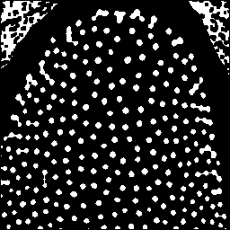
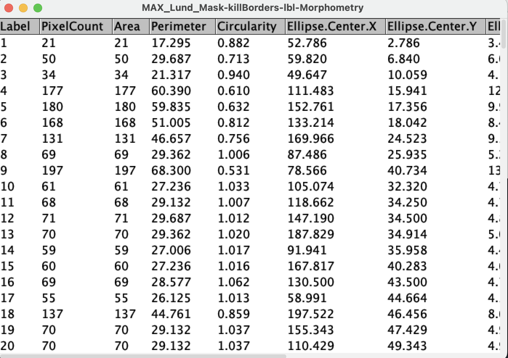
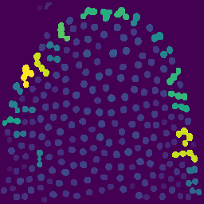
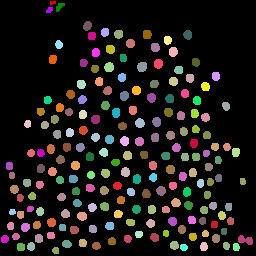

# Introduction to Thresholding in Fiji

In this exercise we will:

- Compare global and local thresholding methods and understand when each is useful.  
- Improve segmentation using background subtraction and Gaussian smoothing.  
- Refine masks using binary operations, including **Fill Holes** and **Kill Borders**.  
- Generate labeled objects using MorphoLibJ's Connected Components Labeling.  
- Extract object-level measurements (area, perimeter, circularity, etc.).  
- Visualize measurement values on labeled images.  
- Filter segmented objects based on size or other properties.  

These steps form a complete workflow:  
**raw image → pre-processing → segmentation → cleanup → labeling → measurement → filtering**

We’ll use `MAX_Lund.tif` as the example image.

---

## 1. Open the image and inspect the histogram

1. Start **Fiji**.  
2. Open the image:  
   `File → Open… → MAX_Lund.tif`  
     
3. Open the histogram and visualization tools:  
   `Image → Adjust → Brightness/Contrast…`

You should see a histogram like this:


**Idea:** Thresholding chooses an intensity value that separates “foreground” from “background”. The histogram shows how many pixels exist at each intensity.

---

## 2. Try all global Auto Threshold methods

Global thresholding applies **one single threshold** to the whole image.

1. With `MAX_Lund.tif` active, run:  
   `Image → Adjust → Auto Threshold…`
2. Choose:  
   - **Method:** *Try all*  
   - **White objects**  
3. Confirm.

Fiji generates a montage of all global methods:


---

## 3. Prepare the image for Auto Local Threshold

Local thresholding requires **8-bit** input.

1. Select the original image:  
   `Window → MAX_Lund.tif`  
2. Convert to 8-bit:  
   `Image → Type → 8-bit`

Now the image is ready for local methods.

---

## 4. Try all Auto Local Threshold methods

Local thresholding computes a threshold for each **local neighborhood**.

1. Run:  
   `Image → Adjust → Auto Local Threshold…`
2. Choose:  
   - **Method:** *Try all*  
   - **Radius:** 15  
   - **Parameter 1:** 0  
   - **Parameter 2:** 0  
   - **White objects**
3. Confirm.


---

## 5. Improving segmentation with background subtraction and smoothing

Good segmentation often benefits from reducing background and noise first.

### 5.1 Remove background and apply Gaussian blur

1. Open `MAX_Lund.png`.  
2. Subtract background:  
   `Process → Subtract Background…`  
   - Rolling ball radius: **50**  
3. Smooth noise:  
   `Process → Filters → Gaussian Blur…`  
   - Sigma: **1**

After preprocessing:


---

## 6. Selecting a method: Local Otsu and binary cleanup

### 6.1 Apply Local Otsu thresholding

1. Run:  
   `Image → Adjust → Auto Local Threshold…`  
   - **Method:** Otsu  
   - **Radius:** 15  

**Local Otsu mask:**


---

### 6.2 Refine the mask with binary operations

2. Fill holes inside objects:  
   `Process → Binary → Fill Holes`  
3. Slightly shrink objects:  
   `Process → Binary → Erode`  
4. Optionally restore outlines:  
   `Edit → Draw`  
5. Expand objects after erosion:  
   `Process → Binary → Dilate`

**Refined mask:**



---

### 6.3 Remove border-touching objects

6. Remove partial objects touching image borders:  
   `Plugins → MorphoLibJ → Filtering → Kill Borders`  


---

## 7. Object labeling with MorphoLibJ

Convert each connected region into a uniquely labeled object:

`Plugins → MorphoLibJ → Label → Connected Components Labeling`

- Connectivity: **4**  
- Output type: **16-bit**

**Labeled objects:**


---

## 8. Measuring object properties

Quantifying each object is often the main goal after segmentation.

Run measurements:

`Plugins → MorphoLibJ → Analyze → Analyze Regions`

This extracts a number of morphological associated features. We will select:

- Area  
- Pixel count  
- Perimeter  
- Circularity  
- Ellipse geometry  
- Bounding box  



---

## 9. Visualizing label properties

Visualize one measurement (e.g. area) mapped onto the label image:

`Plugins → MorphoLibJ → Label Images → Assign Measure to Label`

Choose **Area** and apply a colormap.



Useful for:

- spotting unusually big/small objects  
- deciding filtering thresholds  
- checking measurement correctness  

---

## 10. Filtering objects by size

Remove small objects based on size:

`Plugins → MorphoLibJ → Label Images → Label Size Filtering`

- **Operation:** Lower Than  
- **Size threshold:** 100 px  



---

```


---

# Image processing, denoising, segmentation

Marina (1 hs)
- Segmentation, post-processing, Morphological operations, Labeling (MorphoLibJ in Fiji)
  
  https://knowhowspot.blog/fiji-morphological-segmentation-plugin-guide
- Napari assistant (MC I could do it based on RH talk - 30 min)

